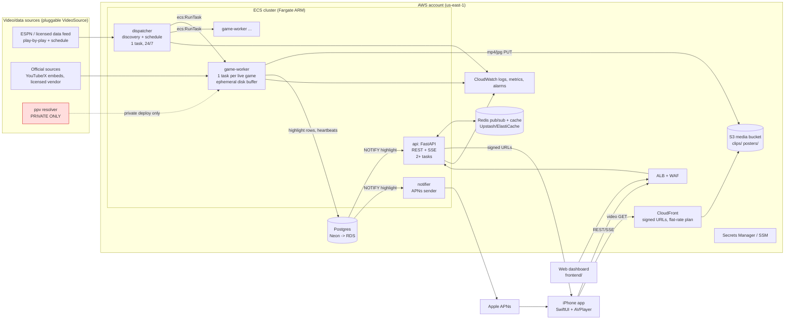

# BigPlays cloud architecture plan

Status: proposal, 2026-09-29. Scope: move BigPlays from a Mac to always-on cloud
infrastructure with cloud-only storage, as the backend for an iPhone app.

Related docs: [cloud.md](cloud.md) covers the existing single-host Docker Compose
deployment, and [stream-integration.md](stream-integration.md) covers the resolver.

---

## 1. Executive summary

**Read the legal section (section 9) first.** Today the live video comes from
`ppv-hls-stream-resolver`, which extracts hidden HLS playlists from an unlicensed
restreaming site (ppv.to/ppv.st). It does this by replaying the embed player's
protobuf handshake and running its WASM decryptor. BigPlays then records
NFL/NCAAF broadcasts and re-hosts clips of them. The same problem applies to
official MLB clips: `bigplays/ingest/mlb_archive.py` downloads official MLB MP4s
and re-hosts them, and MLBAM terms allow only "individual, non-commercial,
non-bulk use". A public App Store app built on either source would very likely:

- be rejected under App Store Review Guidelines 5.2.1 and 5.2.3, or pulled later;
- draw DMCA notices from leagues and broadcasters; and
- risk termination of the hosting account (AWS, Cloudflare and others all prohibit
  infringing content in their acceptable use policies).

So the plan has two tracks that share one codebase:

| Track | Who | Video source | Where it runs |
|---|---|---|---|
| **A. Personal/private** | You only, no public distribution | Whatever you run today (your legal risk; see section 9) | One small cloud VM running the existing `compose.cloud.yaml`, plus object storage and managed Postgres |
| **B. Public iPhone app** | App Store users | **Licensed or official sources only**: official embeds (YouTube/X), your own data and notifications, or a licensed video vendor | AWS: ECS Fargate per-game workers, S3 + CloudFront, Postgres, FastAPI, APNs |

The main architectural change: **make the video source a pluggable interface**
(`VideoSource`). Then the public deployment can ship with a config that cannot
load the ppv source at all (`DEPLOYMENT_MODE=public` refuses `private_only` sources).

**Recommended stack for track B:**

- **Compute:** ECS on Fargate (ARM/Graviton) with three roles.
  - `api`: FastAPI, 2 or more tasks behind an ALB.
  - `dispatcher`: one small task that runs discovery and scheduling.
  - `game-worker`: one task per live game, launched from the game calendar and
    stopped after the final whistle. The resolver runs as a sidecar only where a
    source needs it.
- **Media:** S3 for clips and posters, delivered through CloudFront with signed
  URLs on a flat-rate plan (Pro at $15/mo or Business at $200/mo, each with a
  50 TB/mo allowance). Runner-up: Cloudflare R2 with zero egress. Egress
  dominates video cost, so either choice must avoid pay-as-you-go CDN pricing
  at scale.
- **Database:** Postgres. Use Neon while small; move to RDS Postgres at 10k
  users. Postgres holds all metadata. S3 holds only bytes.
- **Rolling HLS buffer:** stays on the worker's local ephemeral disk, not S3.
- **OCR:** Tesseract, which already exists in `bigplays/media/scoreboard.py` and
  the Dockerfile, with scorebug cropping. A rate-limited vision-LLM fallback
  handles calibration and low-confidence frames. Rekognition is too expensive
  at continuous frame rates.
- **Realtime to iOS:** APNs push for new highlights, plus a paginated REST feed
  and an SSE stream fanned out through Redis or Postgres `LISTEN/NOTIFY`.
- **Auth:** Sign in with Apple, verified directly in FastAPI.
- **iOS client:** SwiftUI + AVPlayer.

**Cost at a glance** (section 8 has details and assumptions):

| Scale | Monthly cost |
|---|---|
| Personal | ~$30–70 |
| ~100 users | ~$250–450 |
| ~10k users | ~$1,000–1,800 with flat-rate CDN or R2, or ~$3,500+ on pay-as-you-go CloudFront |

These figures exclude content or data licensing, which for a public product is
likely to be the largest line item.

---

## 2. What exists today (grounding)

| Concern | Current implementation | Cloud blocker |
|---|---|---|
| API + UI | `bigplays/server/app.py` (FastAPI, SSE `/api/stream`, `/clips` StaticFiles mount, SPA from `frontend/dist`) | Reads clip files from local `CLIPS_DIR`. `_watch_clips_dir()` polls local JSON sidecars. `load_highlights()` returns **every** record, and the SSE `hello` event also sends all of them. CORS is `*`. There is no auth. |
| Event fan-out | `bigplays/server/events.py`, an in-process `EventBus` | Works for a single process only, so it cannot fan out across API replicas |
| Live agent | `bigplays/orchestrator/live_agent.py`: `main()` runs discovery every 60 s and runs up to `AGENT_MAX_GAMES` `GameMonitor`s as asyncio tasks in **one process**, guarded by an `fcntl` lock | Needs to split into a dispatcher and per-game workers |
| Agent ↔ server IPC | Files under `AGENT_DIR`: `status.json`, `control.json` and `requests/*.json` (read and written by `bigplays/server/agent.py`) | Requires a shared filesystem |
| Buffer | `LiveSegmentBuffer` in `bigplays/media/stream_buffer.py` downloads HLS segments over HTTP (no transcoding) and applies retention by minutes and bytes | Fine on ephemeral disk |
| Clip cut | `bigplays/media/hls_clipper.py` tries a stream copy first and falls back to `libx264 veryfast crf 20` | Low CPU. The output lands in `CLIPS_DIR`. |
| OCR | `bigplays/media/scoreboard.py`: `frame_clock()` uses either the Swift/Vision binary (`scripts/scoreboard_ocr.swift`) or `tesseract` (`tesseract_rows()` normalizes to Vision coordinates). Tested by `tests/test_linux_scoreboard.py`. | Linux path exists; accuracy on each broadcaster's scorebug is not yet verified |
| Library | `ClipLibrary` in `bigplays/storage/local_store.py` writes MP4 + JPG + a JSON sidecar and upserts into `HighlightCatalog` (`bigplays/storage/catalog.py`, SQLite, a `payload` JSON column keyed by `event_id`) | Local disk and SQLite |
| S3 | `bigplays/storage/s3_store.py` (flat `prefix + filename` keys, used only by legacy `main.py` `_upload_if_enabled`). `ENABLE_S3` does nothing in the live agent. | Needs a real media store abstraction |
| Stream source | `bigplays/ingest/live_streams.py` + `ppv_provider.py` + Node `ppv-hls-stream-resolver/` (WASM decrypt, `impit` Chrome-TLS relay) | **Legal blocker for public use** (section 9). Datacenter IPs may also be blocked. |
| Official MLB | `bigplays/ingest/mlb_archive.py` pulls from the MLB Stats API and downloads official MP4s into `CLIPS_DIR` | MLBAM terms allow only non-commercial use |
| Play-by-play | ESPN's undocumented `site.api.espn.com` (`ingest/espn.py`, `ingest/plays.py`) | Unofficial API with no license and no SLA |
| Social | Reddit API or Playwright browser (`ingest/reddit_browser.py`), Mastodon, and a local Ollama `qwen3:4b` judge (`orchestrator/social_ranker.py`) | Browser scraping from cloud IPs is likely to be blocked. Ollama adds 4–6 GB RAM per host. |
| Packaging | `Dockerfile` (targets `frontend`, `resolver`, `runtime`), `compose.cloud.yaml`, `cloud.env.example` | Phase 0 is largely done already |

Local library size today is 431 clips and 5.8 GB, about 13.5 MB per clip on
average (360 NFL, 34 NCAAF, 36 MLB). The SQLite catalog is 1.1 MB.

---

## 3. Recommended architecture



Request flow for one big play:

1. The dispatcher sees game X going live (ESPN scoreboard, or `upcoming_games()`
   ten minutes before kickoff). It calls `ecs.run_task` for a `game-worker` with
   `GAME_JSON` set.
2. The worker fills its local buffer, OCRs the scorebug, polls play-by-play,
   and cuts the clip. It then transcodes a 720p mobile rendition, uploads
   `source.mp4`, `mobile.mp4` and `poster.jpg` to S3, and upserts the highlight
   row in Postgres, which fires `NOTIFY highlight`.
3. The API pushes an SSE `highlight` event to connected clients. The notifier
   sends APNs alerts (collapse-id = `event_id`) to users who follow that team
   or league.
4. The phone fetches `/v1/highlights/{id}` and receives a short-lived CloudFront
   signed URL. AVPlayer streams the MP4 from the edge.

---

## 4. Component mapping: local to cloud

| Component | Local today | Recommended cloud choice | Runner-up | Notes |
|---|---|---|---|---|
| API server | uvicorn on the Mac, `server/app.py` | **ECS Fargate service** (ARM, 0.5–1 vCPU / 1–2 GB, 2+ tasks) behind an **ALB** | Fly.io Machines | Keep FastAPI. Set ALB idle timeout ≥ 120 s for SSE (keep-alive comments are already sent every 15 s). |
| Live agent (discovery loop) | `live_agent.main()` | **`dispatcher` Fargate service** (0.25 vCPU / 0.5 GB, desired count 1) | EventBridge Scheduler + Lambda each minute | Holds a Postgres advisory lock instead of `fcntl` |
| Per-game recording | `GameMonitor` asyncio tasks in one process | **One Fargate task per game** via `RunTask` (1 vCPU / 2 GB ARM, 30–50 GB ephemeral) | ECS on an EC2 capacity provider (c7g/c8g Auto Scaling group) once concurrency stays above ~15 games | Per-second billing, so no idle workers. Use on-demand, not Spot, because a 2-minute Spot interruption loses the rolling buffer. |
| Stream resolver | Node process on :3000 | **Sidecar container in the game-worker task** (only for sources that need it; private deployment only) | A separate internal ECS service | A sidecar keeps segment relay on localhost, so there is no cross-AZ traffic |
| Rolling HLS buffer | `data/agent/<league>-<id>/` | **Task ephemeral disk** | EBS volume on EC2 | Section 5.3 explains why not S3 |
| Clip + poster files | `data/clips/*.mp4/.jpg` | **S3** (`bigplays-media-<env>`) behind **CloudFront** with OAC + signed URLs | **Cloudflare R2** + Cloudflare CDN (zero egress, $0.015/GB-mo) | Both are S3-API compatible, so one `S3MediaStore` with an `endpoint_url` covers either |
| Metadata DB | SQLite `data/clips.sqlite3` | **Neon Postgres** (Launch plan) → **RDS Postgres** (db.t4g.medium Multi-AZ) at 10k users | Supabase Postgres (bundles Auth + Realtime) | DynamoDB is not recommended: the feed and filter queries are relational, and the existing JSON `payload` maps cleanly to `jsonb` |
| JSON sidecars | `data/clips/*.json` | **Removed in cloud mode.** Postgres is the source of truth. | none | Keep them in local mode for back-compat |
| Agent status/control/requests | `status.json`, `control.json`, `requests/*.json` | **Postgres tables** `workers`, `agent_control`, `clip_requests` | Redis hashes | Unblocks multiple API replicas |
| Event bus | in-process `EventBus` | **Postgres `LISTEN/NOTIFY`** at small scale → **Redis pub/sub** (Upstash or ElastiCache) at 10k | AWS SNS/SQS | The API keeps a local `EventBus` per replica, fed from the channel |
| Scorebug OCR | Swift/Vision (`data/tools/scoreboard-ocr`) | **Tesseract in the worker** (already implemented) plus scorebug crop and preprocessing | PaddleOCR (PP-OCR, CPU); vision-LLM fallback | Section 5.4 |
| Social LLM judge | Ollama `qwen3:4b` | **Hosted small model via API** (`SOCIAL_LLM_PROVIDER=anthropic`, already supported) | A dedicated Ollama task (≥ 2 vCPU / 8 GB) | Avoids 4–6 GB RAM on every host. Calls are already capped by `SOCIAL_LLM_CALLS_PER_HOUR`. |
| Reddit | API or Playwright browser | **Reddit API (OAuth) only** | Mastodon/other feeds (`ingest/social_feeds.py`) | The browser path will likely be blocked from datacenter IPs. Drop Chromium from the worker image. |
| Push | none | **APNs direct** (HTTP/2, `.p8` token auth) from a `notifier` service | AWS SNS Mobile Push / OneSignal | APNs is free |
| Auth | none | **Sign in with Apple**, verified in FastAPI (JWKS), app-issued JWT | Cognito (Apple IdP) / Supabase Auth | Also protect admin routes (`/api/agent/*`, `/api/recording/*`) |
| Secrets | `.env`, `cloud.env` | **SSM Parameter Store** (SecureString) for config, **Secrets Manager** for the DB URL, APNs key and CloudFront signing key | Doppler / 1Password | Injected into tasks via `secrets:` in the ECS task definition |
| Logs/metrics | stdout | **CloudWatch Logs** (14-day retention) + **EMF metrics** + **CloudWatch alarms → SNS → email/Slack**; **Sentry** for exceptions | Grafana Cloud | Section 7 |
| CI/CD | none | **GitHub Actions** → multi-arch images (`api`, `worker`, `resolver`) → **ECR** → `aws ecs update-service` / new task-def revision | AWS CodePipeline | |
| IaC | none | **Terraform** (`infra/terraform/`) | AWS CDK (Python) | |
| Web dashboard | `frontend/dist` served by FastAPI | Keep it served by the API, or move it to S3 + CloudFront | Cloudflare Pages | Put it behind auth |

### Compute comparison (for always-on, ffmpeg-heavy workers)

The workload is lighter than it looks. `LiveSegmentBuffer` downloads segments
without re-encoding, and cuts are stream copies. The remaining CPU goes to:

- two frame decodes plus Tesseract per segment (about 1 frame every 2–3 s);
- occasional `libx264` fallback encodes; and
- the new 720p mobile rendition (about 20–40 CPU-seconds per clip).

Budget **0.5–1 vCPU and 1–2 GB per game**, and measure it in Phase 2. Ingest is
about 2–3 GB per game-hour at 5–6 Mbps. Ingress is free on every provider below.

| Option | Per-game cost model | Fit | Verdict |
|---|---|---|---|
| **ECS Fargate (ARM)** | $0.03238/vCPU-h + $0.00356/GB-h (us-east-1). 1 vCPU / 2 GB ≈ **$0.040/h**, plus $0.005/h public IPv4 | Per-second billing. `RunTask` per game maps directly onto `GameMonitor`. No hosts to patch. | **Recommended** for the public track |
| EC2 (c7g/c8g ASG as an ECS capacity provider) | c7g.xlarge (4 vCPU) ≈ $0.145/h on-demand, packing ~4–6 games | Cheaper at high sustained concurrency, but you manage AMIs and bin packing | Graduate to this when MLB + NBA overlap pushes concurrency past ~15 |
| Fly.io Machines | Per-second VMs, started and stopped through the Machines API | A good per-game model with simple ops, but egress is billed and Postgres/S3 still live elsewhere | Runner-up |
| Railway / Render | Always-on services billed on resources or instance size | A poor fit for dynamic per-game jobs, and bandwidth is metered | Not recommended |
| Single VPS (Hetzner / DO / Lightsail / EC2 t4g) | Flat monthly | Ideal for the **personal** track: `compose.cloud.yaml` already runs there. After Hetzner's June 2026 repricing, CAX ARM (EU only) remains cheap (CAX31 at 8 vCPU / 16 GB for €20.99), but US CPX prices rose 2.4–3.1x. | **Recommended for personal use** |

**Networking trap:** do **not** put game workers in private subnets behind a NAT
Gateway. A NAT Gateway charges $0.045/GB processed, which on ~2.5 GB per
game-hour of ingest would cost more than the compute. Use public subnets with a
public IPv4 ($0.005/h) and locked-down security groups, or dual-stack IPv6 where
upstreams support it. Add S3 and ECR VPC gateway/interface endpoints.

---

## 5. Data model: Postgres vs object storage vs cache

**Rule:** S3/R2 is object storage (immutable blobs addressed by key), not a
database. Anything you query, filter, sort, update or join goes in Postgres.
Anything large and binary goes in S3 and is referenced from Postgres by key.
Anything ephemeral or fan-out goes in Redis, or stays on the worker's local disk.

### 5.1 Postgres schema (initial)

The schema keeps the existing `payload` JSON so `HighlightCatalog` semantics port
unchanged, then promotes hot fields to columns.

```sql
-- direct port of catalog.py `highlights`, plus media + rights columns
CREATE TABLE highlights (
  event_id      text PRIMARY KEY,                -- stable: sha256(league:game:play)[:24] or mlb-...
  dataset       text,                            -- replay_dataset
  league        text NOT NULL,
  game_id       text,
  play_id       text,
  occurred_utc  timestamptz,
  received_utc  timestamptz,
  captured_utc  timestamptz,
  title         text,
  status        text NOT NULL DEFAULT 'published', -- published | hidden | takedown | pending_review
  source_type   text NOT NULL,                   -- recorded | official_mlb | youtube_embed | licensed_vendor
  source_ref    text,                            -- vendor id / YouTube id / upstream URL
  rights        jsonb,                           -- license id, territory, expiry, attribution
  media         jsonb,                           -- {source_key, mobile_key, poster_key, duration, bytes, w, h, rev}
  payload       jsonb NOT NULL,                  -- full legacy record (alignment, capture, social_* ...)
  created_utc   timestamptz NOT NULL DEFAULT now(),
  updated_utc   timestamptz NOT NULL DEFAULT now()
);
CREATE INDEX ON highlights (league, received_utc DESC);
CREATE INDEX ON highlights (game_id);
CREATE INDEX ON highlights (dataset, occurred_utc DESC);

CREATE TABLE import_runs (import_key text PRIMARY KEY, payload jsonb NOT NULL, updated_utc timestamptz NOT NULL);

-- replaces agent files
CREATE TABLE games   (league text, game_id text, name text, starts_at timestamptz, state text,
                      source jsonb, PRIMARY KEY (league, game_id));
CREATE TABLE workers (game_key text PRIMARY KEY, task_arn text, status text, heartbeat timestamptz,
                      last_segment_at timestamptz, segments int, clock_observations int,
                      reconnects int, error text, detail jsonb);            -- was status.json
CREATE TABLE agent_control (id int PRIMARY KEY DEFAULT 1, enabled bool NOT NULL, max_games int);  -- was control.json
CREATE TABLE clip_requests (game_id text, play_id text, requested_by uuid, created_utc timestamptz,
                            PRIMARY KEY (game_id, play_id));                -- was requests/*.json
CREATE TABLE worker_checkpoints (game_key text PRIMARY KEY, observations jsonb, scanned jsonb,
                                 updated_utc timestamptz);                 -- was clocks.json / scanned.json

-- mobile
CREATE TABLE users   (id uuid PRIMARY KEY, apple_sub text UNIQUE NOT NULL, created_utc timestamptz, deleted_utc timestamptz);
CREATE TABLE devices (id uuid PRIMARY KEY, user_id uuid REFERENCES users, apns_token text UNIQUE,
                      environment text, app_version text, last_seen timestamptz);
CREATE TABLE follows (user_id uuid REFERENCES users, kind text, value text,  -- kind: league|team
                      PRIMARY KEY (user_id, kind, value));
CREATE TABLE notifications_sent (user_id uuid, event_id text, sent_utc timestamptz, apns_id text,
                                 PRIMARY KEY (user_id, event_id));          -- idempotent push
CREATE TABLE takedowns (id bigserial PRIMARY KEY, event_id text, received_utc timestamptz,
                        claimant text, notice jsonb, action text);          -- DMCA process
```

Social enrichment (`social_*` keys written after publication, which `ClipLibrary.persist`
must never overwrite) stays inside `payload` at first. Use a `jsonb` merge
(`payload || $patch`) inside `SELECT ... FOR UPDATE`, which replaces the SQLite
`BEGIN IMMEDIATE` read-merge-write in `HighlightCatalog.patch`.

### 5.2 S3/R2 key layout

```
s3://bigplays-media-<env>/
  clips/v1/<league>/<season>/<game_id>/<event_id>/r<rev>/source.mp4     # as cut (copy mode), faststart
  clips/v1/<league>/<season>/<game_id>/<event_id>/r<rev>/mobile.mp4     # 720p H.264/AAC, ~2.5 Mbps
  clips/v1/<league>/<season>/<game_id>/<event_id>/r<rev>/poster.jpg     # full size
  clips/v1/<league>/<season>/<game_id>/<event_id>/r<rev>/poster-480.jpg
  datasets/<dataset>/<file>                                              # demo_clips, nfl-week3 replay sets
  debug/ocr-frames/<game_key>/<epoch>.jpg                                # lifecycle: expire 7 days
  backups/postgres/<date>/...  and  backups/sqlite/<date>/clips.sqlite3  # lifecycle: 90 days
  legacy/data-clips/<original filename>                                  # one-time raw copy for audit
```

- `r<rev>` makes every object immutable, so CloudFront can use
  `Cache-Control: public, max-age=31536000, immutable`. A re-cut (from
  `correct_play_metadata` or a manual clip) bumps `rev` and updates
  `highlights.media`.
- Bucket settings: private, Block Public Access on, CloudFront OAC only,
  versioning on, SSE-S3 encryption.
- Lifecycle rules: `source.mp4` moves to S3 Standard-IA after 60 days. `debug/`
  expires after 7 days.
- Takedown means setting `status='takedown'` and deleting the objects (and
  their prior versions) under the `event_id/` prefix.

### 5.3 Rolling buffer: local ephemeral disk, not S3

The buffer holds `AGENT_BUFFER_MINUTES` (default 30) of `.ts` segments, capped
by `AGENT_BUFFER_MAX_MB` (default 2 GB). Keep it on the worker's local disk:

- `hls_clipper.cut_timeline_window` builds an ffmpeg concat manifest over local
  files. Cuts take under a second in copy mode, and S3 round-trips would add
  latency to the event-to-clip time (`capture.event_to_clip_seconds`).
- OCR reads every segment twice. Local reads are free, while S3 would add
  GET/PUT requests on every read and write.
- The data is disposable. If a worker dies, the replacement task refills from the
  provider's rewind window, and clips already cut are safe in S3.
- Checkpoint only the small state (`clocks.json` observations and `scanned.json`)
  to `worker_checkpoints` every ~30 s, so a restarted worker keeps its clock
  alignment.
- Fargate gives 20 GB ephemeral storage by default and up to 200 GB configurable.
  Set 30–50 GB.

### 5.4 Replacing Mac-only OCR

Workload: 2 frames per segment is roughly 1,200–1,800 frames per game-hour. At
around 1,500 worker-hours per month in season, that is 2–3 million frames a month.

| Option | Cost at 2–3M frames/mo | Latency | Accuracy on scorebugs | Verdict |
|---|---|---|---|---|
| **Tesseract 5** (already wired: `frame_clock(..., 'tesseract')`, `tesseract_rows()`) | ~$0 (CPU already paid for; ~0.1–0.3 CPU-s per cropped frame) | ~100–300 ms | Good on clean digits **if you crop the scorebug region and upscale/threshold first**. Weak on stylized broadcaster fonts and full-frame input. | **Primary** |
| PaddleOCR (PP-OCRv4/v5 CPU) | ~$0 plus more CPU/RAM (~0.5 GB model) | ~100–400 ms per crop | Better than Tesseract on stylized, low-contrast text | Runner-up. Swap in if Tesseract's clock-hit rate is below target for a broadcaster. |
| AWS Rekognition DetectText | ~$1 per 1,000 images (verify current tier) → **~$2,000–3,000/mo** | ~0.5–1 s plus network | Good | Too expensive at continuous rates |
| AWS Textract DetectDocumentText | $1.50 per 1,000 pages → ~$3,000–4,500/mo | 1 s+ | Tuned for documents, not video overlays | No |
| Vision LLM (Haiku-class model, small crop) | ~$0.3–2 per 1,000 crops depending on crop size | 1–3 s | Excellent, and can also *find* the scorebug and infer layout | **Fallback only**: calibration, plus a rate-limited call when Tesseract has produced no clock for N minutes |

Plan for OCR:

1. Add a per-broadcast scorebug calibration step. On worker start, run one
   vision-LLM call or a full-frame Tesseract pass to locate the clock/period
   bounding box. Store it in `worker_checkpoints` and crop every later frame to
   it in `frame_clock` (ffmpeg `crop=` filter).
2. Preprocess the crop: 2–3x upscale, grayscale, then threshold. Set Tesseract
   to `--psm 7` with a digits/colon/period whitelist.
3. Emit an `ocr_clock_hit_rate` metric and alarm when it is below target.
4. The existing safety property carries over as is: an uncertain clock keeps the
   clip pending and never guesses.

### 5.5 Cache / Redis

- Pub/sub channel `highlights` (new or updated rows) fans out to every API
  replica's local `EventBus`, then to SSE clients.
- Hot feed cache (`feed:<league>:first-page`, TTL 5 s) and rate limits per
  user/IP.
- Push de-duplication is backed by `notifications_sent` in Postgres. Redis is
  only a fast path.
- At personal or 100-user scale, Postgres `LISTEN/NOTIFY` is enough and Redis
  can be skipped.

---

## 6. Phased migration

Each phase ships independently. Local mode (SQLite + `data/clips`) must keep
working throughout, and tests stay green (`tests/test_catalog.py`,
`test_capture_persistence.py`, `test_live_agent.py` and others).

### Phase 0: Containerize (mostly done)

Already present: the `Dockerfile` (targets `frontend`, `resolver`, `runtime`
with ffmpeg + Tesseract + Chromium), `compose.cloud.yaml`, `cloud.env.example`
and `docs/cloud.md`. Remaining work:

- **Split images.** In `Dockerfile`, add `api` and `worker` targets. The worker
  needs no Playwright/Chromium unless `REDDIT_SOURCE=browser`, which cuts image
  size and CVE surface. Build for `linux/arm64` and `linux/amd64`.
- **Config** (`bigplays/config.py`, `env.example`, `cloud.env.example`): add
  - `DEPLOYMENT_MODE` (`local|private|public`) and `VIDEO_SOURCES` (list);
  - `DATABASE_URL`;
  - `MEDIA_BACKEND` (`local|s3`), `MEDIA_BUCKET`, `MEDIA_ENDPOINT_URL` (for R2)
    and `MEDIA_CDN_BASE_URL`;
  - `CLOUDFRONT_KEY_ID` and `CLOUDFRONT_PRIVATE_KEY` (secret);
  - `EVENTS_BACKEND` (`memory|postgres|redis`) and `REDIS_URL`;
  - `WORKER_LAUNCHER` (`local|ecs`), `ECS_CLUSTER` and `ECS_WORKER_TASKDEF`.

  Also replace the stale `LLM_MODEL` default (`claude-3-5-sonnet-20240620`)
  with a current model ID.
- **Logging.** In `bigplays/utils/logging.py`, emit structured JSON logs with
  `structlog`, which is already in `requirements.txt`. Include `game_key` and
  `event_id` fields. Never log signed URLs (`live_agent.capture` already takes
  care with this).
- **Health.** Replace the worker health check that reads `status.json` in
  `compose.cloud.yaml` with a heartbeat to the DB. Add a small `/healthz` on
  `api`.
- **Deploy the personal track now.** Personal use can stop at Phase 0 + Phase 1:
  a single VM running `compose.cloud.yaml` with media and DB moved to the cloud.

### Phase 1: Cloud storage + database

1. **Media store abstraction.** Add a new `bigplays/storage/media_store.py`:
   - `MediaStore` protocol: `put_file(local, key, content_type, cache_control) -> key`,
     `url_for(key, ttl) -> str`, `exists(key)` and `delete_prefix(prefix)`.
   - `LocalMediaStore` maps keys to `CLIPS_DIR` and URLs to `/clips/...`.
   - `S3MediaStore` replaces `bigplays/storage/s3_store.py`. It uses boto3 with
     an optional `endpoint_url` for R2, sets `ContentType` and `CacheControl`,
     and signs URLs with `botocore.signers.CloudFrontSigner` (canned policy,
     TTL of about 1 h).
2. **Catalog abstraction.** In `bigplays/storage/catalog.py`, extract a `Catalog`
   protocol from `HighlightCatalog`: `upsert`, `patch`, `get`, `all` (which gains
   `limit`, `cursor`, `league` and `status`), `save_import`, `imports` and
   `backup`. Add `PostgresCatalog` using psycopg 3, a pool and `jsonb`.
   `catalog_for()` picks the implementation from `DATABASE_URL`. `migrate_sidecars()`
   stays in the SQLite implementation only. Add Alembic migrations (`migrations/`).
3. **Clip library.** In `bigplays/storage/local_store.py` (`ClipLibrary`):
   - `persist()` uploads the MP4 and JPG through `MediaStore`, writes
     `media.{source_key, poster_key, bytes, duration, rev}`, then upserts. In
     cloud mode it writes no sidecar and removes the local temporary files after
     a verified upload (compare size and ETag).
   - `saved()` checks the catalog row's `media.source_key` instead of whether a
     local file exists.
4. **Live agent.** In `bigplays/orchestrator/live_agent.py`:
   - `clip_play()` cuts to a temporary path under the worker's disk (not
     `settings.clips_dir`).
   - `correct_play_metadata()` reads through `library.catalog.get(clip_id(...))`
     instead of `settings.clips_dir / '<id>.json'`.
   - `last_clip['file']` becomes a media key, and the API resolves it to a URL.
5. **Clipper.** In `bigplays/media/hls_clipper.py`, after the cut, produce
   `mobile.mp4` (720p, `-preset veryfast -crf 23 -movflags +faststart`) and
   `poster-480.jpg`. Report their keys through the returned `info`.
6. **Server.** In `bigplays/server/app.py`:
   - `load_highlights()` stops checking `(clips_dir / file).exists()` and adds
     `video_url`, `mobile_url` and `poster_url` from `MediaStore.url_for`.
   - Mount `/clips` StaticFiles only when `MEDIA_BACKEND=local`.
   - Replace `_watch_clips_dir()` and `changed_highlights()` with a catalog
     notification listener (`LISTEN highlight`).
   - Paginate `/api/highlights`, and cap the SSE `hello` `recent` payload to
     about 50.
   - `bigplays/server/social.py` (`catalog.all()` loops) and
     `bigplays/server/streams.py` (`/api/recording/clip` writes into `clips_dir`)
     move to `ClipLibrary` and paginated queries.
7. **Frontend.** `frontend/src/components/util.ts`, `FeedItem.tsx`, `Player.tsx`
   and `types.ts` should prefer `video_url`/`poster_url` and fall back to
   `/clips/<file>` for local mode.
8. **Migration script.** A new `scripts/migrate_to_cloud.py`, idempotent and
   resumable, with `--dry-run`:
   1. Take a snapshot with `HighlightCatalog.backup()` to
      `data/backups/pre-cloud.sqlite3` and upload it to `backups/sqlite/`.
   2. For each row in `catalog.all()`: resolve `file` and `poster` under
      `data/clips`, upload to the `clips/v1/...` keys, and verify the size.
      Probe duration with `ffmpeg_utils` and generate `mobile.mp4` if it is
      missing.
   3. Insert into Postgres with `payload` unchanged and `media`/`source_type`
      filled (`official_mlb` for `mlb-*` IDs and `recorded` for the rest).
      Preserve `created_utc`, `received_utc` and `captured_utc`.
   4. Copy `import_runs`.
   5. Report orphans: files without rows and rows without files. `data/clips`
      has 1,258 files for 431 rows (MP4 + JSON + JPG).
   6. Upload `data/demo_clips` and `data/nfl-week3` under `datasets/`, but only
      if you keep those datasets.

   At 5.8 GB this finishes in minutes. `rclone copy` or `aws s3 sync` of
   `data/clips` into `legacy/` makes a useful raw audit copy.
9. **Personal-track shortcut.** If you want to keep SQLite on one VM, run
   **Litestream** to replicate `clips.sqlite3` continuously to S3/R2, and set
   only `MEDIA_BACKEND=s3`. Postgres becomes mandatory once there is more than
   one process writing, as in Phase 2.

### Phase 2: Cloud workers

1. **Pluggable video sources.** Add a new package `bigplays/ingest/sources/`
   (`__init__.py`, `base.py`):
   - `VideoSource` protocol: `name`, `private_only: bool`,
     `async discover(scoreboards) -> list[SourceMatch]`, and either
     `async open_live(game) -> LiveInput` (an HLS root for `LiveSegmentBuffer`)
     or `async clips_for(game) -> list[OfficialClip]` (an embed or licensed
     asset, no recording).
   - `ppv.py` wraps today's `live_streams.discover()`, `ppv_provider.py` and
     `GameMonitor.resolve()`, with `private_only=True`.
   - `mlb_official.py` wraps `mlb_archive.py`. For the public track, switch it
     from downloading to **metadata + link/embed** unless MLBAM licenses it.
   - `youtube_embed.py` matches official league or team channel uploads
     (YouTube Data API) to plays and stores only the video ID. It never
     downloads.
   - `licensed_vendor.py` is a stub for a contracted feed.
   - The registry refuses any `private_only` source when
     `DEPLOYMENT_MODE=public`. Add a unit test for this guard.
2. **Dispatcher.** Add `bigplays/orchestrator/dispatcher.py`, containing the
   `main()` loop moved out of `live_agent.py`:
   - It keeps discovery, `DISCOVERY_EXCLUDED_LEAGUES`, sorting and the cap, and
     uses `upcoming_games()` in `ingest/live_streams.py` to pre-warm workers ten
     minutes before start.
   - It replaces the `fcntl` lock with `pg_try_advisory_lock`.
   - It reads `agent_control` instead of `control.json`, and writes `games` and
     `workers` rows.
   - It launches through a `WorkerLauncher` interface: `LocalLauncher` keeps
     today's asyncio tasks for compose/dev, and `EcsLauncher` uses boto3
     `ecs.run_task` with the task definition, subnets and `GAME_JSON` env
     override, and stops the task when the game is finished and
     `finished_at + 660 s` has passed (current logic).
   - It restarts workers whose heartbeat is older than 90 s.
   - The buffer-pruning code for inactive games in `main()` is unnecessary in
     cloud mode, because the task disk disappears with the task.
3. **Worker entrypoint.** Add `bigplays/orchestrator/worker.py`, which runs one
   `GameMonitor` from `GAME_JSON`.
   - It sends heartbeats of `monitor.status()` into `workers` every 5 s,
     replacing `status.json`.
   - It checkpoints observations to `worker_checkpoints`.
   - It handles SIGTERM gracefully (`stop_grace_period` → ECS `stopTimeout` 60 s).
   - It reads manual clip requests from `clip_requests` instead of
     `AGENT_DIR/requests/*.json` (`GameMonitor.request_path`).
   - Add a CLI command in `bigplays/main.py`: `bigplays worker run --game-json ...`.
4. **Server agent routes.** In `bigplays/server/agent.py`, `/api/agent` reads
   `workers` and `agent_control`, `/api/agent/control` updates `agent_control`,
   and `/api/agent/clip` inserts into `clip_requests`. All three are admin-only.
5. **Resolver.** For the private deployment only, run `ppv-hls-stream-resolver`
   as a sidecar in the worker task definition, with
   `RESOLVER_BASE_URL=http://127.0.0.1:3000` and `RESOLVER_API_KEY` from Secrets
   Manager. Expect datacenter IP blocking by upstreams (see Risks).
6. **OCR.** Changes in `bigplays/media/scoreboard.py` and `live_agent.scan()`:
   add scorebug calibration and cropping as in section 5.4. Add an optional new
   module, `bigplays/media/ocr_fallback.py`, for rate-limited vision-LLM reads.
   Set `SCOREBOARD_OCR_BIN=tesseract` in the task definition. In the Dockerfile,
   the worker image's Tesseract setup includes `OMP_THREAD_LIMIT=1` (already
   set).
7. **Social.** Set `SOCIAL_LLM_PROVIDER=anthropic` with a current Haiku-class
   model, or disable the gate. Set `REDDIT_SOURCE=api`. `SocialJudge` and
   `RedditClient` are shared per process today. In per-game workers each task
   has its own, so enforce `SOCIAL_LLM_CALLS_PER_HOUR` globally with a Redis or
   Postgres token bucket.
8. **Infrastructure.** Add Terraform under `infra/terraform/` covering:
   - VPC with public subnets and no NAT, plus S3/ECR endpoints;
   - ECS cluster, task definitions (api, dispatcher, worker+resolver, notifier)
     and ECR repos;
   - ALB + WAF;
   - S3 bucket with lifecycle rules, and CloudFront with OAC, a key group and a
     flat-rate plan;
   - Neon or RDS, Secrets Manager/SSM entries, CloudWatch alarms, AWS Budgets;
   - IAM roles (the dispatcher may `ecs:RunTask` and `iam:PassRole` only for the
     worker role; workers may `s3:PutObject` only on `clips/*`).

### Phase 3: Mobile API + push

1. **Versioned API.** Add `bigplays/server/api_v1.py` with these routes:
   - `GET /v1/feed?league=&team=&cursor=` (keyset pagination on
     `received_utc, event_id`);
   - `GET /v1/highlights/{id}`, which returns metadata plus signed
     `mobile_url`/`poster_url`, or an `embed` object for `youtube_embed`
     sources;
   - `GET /v1/games/live`;
   - `GET /v1/stream` (SSE with `Last-Event-ID` resume, backed by Redis or PG
     notify);
   - `POST /v1/devices` (APNs token + environment), `PUT /v1/follows` and
     `GET/DELETE /v1/me` (in-app account deletion is required by App Store
     guideline 5.1.1(v)).

   Keep the current `/api/*` routes for the web dashboard.
2. **Auth.** Add `bigplays/server/auth.py`. It verifies the Sign in with Apple
   `identityToken` (RS256, Apple JWKS at `https://appleid.apple.com/auth/keys`,
   `iss`, `aud` = bundle ID, `exp`, nonce). It upserts `users.apple_sub` and
   issues app access JWTs (15 min) and refresh tokens (rotating, stored hashed).
   It also adds an admin role for the agent, recording and demo routes. Replace
   `allow_origins=["*"]` in `server/app.py` with the dashboard origin.
3. **Push.** Add `bigplays/notify/apns.py` and a `notifier` service:
   - It listens for new `published` highlights, selects devices from `follows`,
     and sends through APNs HTTP/2 with a `.p8` token (reuse the JWT for up to
     60 min).
   - Headers: `apns-push-type: alert`, `apns-collapse-id: <event_id>`,
     `thread-id: <game_id>` and `mutable-content: 1`, so a Notification Service
     Extension can attach the poster.
   - It records `notifications_sent` for idempotency, deletes tokens on
     410 `Unregistered`, and keeps separate sandbox and production endpoints.
   - It rate-limits per user (for example, at most N per game) to avoid
     spamming on busy games.
4. **Optional Live Activities.** Push live score updates to an ActivityKit Live
   Activity per followed game (`apns-push-type: liveactivity`).

### Phase 4: iOS app

- **Stack:** Swift 6, SwiftUI, and iOS 18+ as the minimum.
  - Networking: `URLSession` async/await, with Codable models generated from
    FastAPI's OpenAPI (`swift-openapi-generator`).
  - Live feed: SSE via `URLSession.bytes(for:)`. Fall back to polling
    `/v1/feed` every 30 s when in the foreground.
  - Playback: `AVPlayer`/`VideoPlayer` on the signed CloudFront `mobile.mp4`
    (progressive with range requests). Move to HLS renditions later if clips
    get longer.
  - Official embeds: `WKWebView` with the YouTube IFrame player, following the
    YouTube API ToS.
  - Auth: `AuthenticationServices` (Sign in with Apple) with tokens in the
    Keychain.
  - Push: `UNUserNotificationCenter` + a Notification Service Extension for the
    poster thumbnail.
- **Screens:** Feed (league filter), Game (live score + that game's plays),
  Highlight player, Follows/Settings, and Account (sign out, delete).
- **No downloading or saving of video** beyond the normal AVPlayer cache.
  Offline saving triggers guideline 5.2.3.
- **Distribution:** Xcode Cloud or fastlane → TestFlight → App Store. Attach
  documentation of rights for every video source in App Store Connect's App
  Review notes. Section 9 explains why this cannot be done for the ppv or
  re-hosted MLB sources.

---

## 7. Ops

**Secrets.**
- SSM Parameter Store holds non-rotating config (the standard tier is free).
- Secrets Manager holds `DATABASE_URL`, `RESOLVER_API_KEY` (private track only),
  the APNs `.p8`, the CloudFront private key, `ANTHROPIC_API_KEY` and Reddit
  OAuth credentials. Budget about $0.40 per secret per month.
- Tasks read them through ECS `secrets`. Nothing lives in images or
  `cloud.env` in the cloud.

**Logs and metrics.**
- CloudWatch Logs with 14-day retention. Add Sentry for exceptions in the
  worker and API.
- Emit metrics from the worker using CloudWatch Embedded Metric Format (JSON
  logs, so no extra API calls):
  - `last_segment_age_seconds` (from `LiveSegmentBuffer.stalled`/`health()`);
  - `segments_buffered`, `reconnects`;
  - `ocr_frames`, `ocr_clock_hits`;
  - `plays_polled_age_seconds`;
  - `clips_created`, `event_to_clip_seconds` (already computed in
    `metadata['capture']`);
  - `upload_failures`.

**Alerting.** Alarms go to SNS, then email or a Slack webhook.
- *Stream stalled:* `last_segment_age_seconds > 120` for 3 minutes on a worker
  whose game is `in` progress. The worker already re-resolves after
  `STALL_SECONDS = 45`, so the alarm fires only if self-healing fails.
- *Alignment dead:* `ocr_clock_hits == 0` for 10 minutes during live play.
- *Worker missing:* the dispatcher sees a scheduled live game with no fresh
  heartbeat for more than 90 s. It restarts the task and alerts after the second
  restart.
- *Dispatcher heartbeat stale*, *API 5xx rate*, *APNs error rate* and
  *DB connections/CPU*.
- *Cost:* AWS Budgets at 50/80/100% of the monthly target, plus a
  daily-anomaly monitor.

**CI/CD.** GitHub Actions workflow:
1. Run `pytest` (77 tests today), the Node tests in `ppv-hls-stream-resolver/test`
   and the frontend build.
2. Build with `docker buildx` for arm64 and push to ECR, tagged with the git SHA.
3. Run `terraform plan` on PRs and `apply` on main behind manual approval.
4. Deploy the ECS service (rolling for `api`/`notifier`, replace for the
   `dispatcher`). New game-worker tasks pick up the new task-def revision, and
   running games finish on the old image.

**IaC.** Use Terraform with state in an S3 backend. Create separate `dev` and
`prod` workspaces with separate buckets and databases.

**Cost controls.**
- Hard cap on concurrent workers: `agent_control.max_games`, replacing
  `AGENT_MAX_GAMES`, with a league/priority policy.
- No NAT Gateway. Log retention at 14 days.
- S3 lifecycle rules (IA and expiry).
- Flat-rate CDN plan, or R2.
- Mobile renditions to cut egress by roughly 60% versus the current ~13.5 MB
  source clips.
- Stop workers promptly after the final whistle (already `finished_at + 660 s`).

---

## 8. Monthly cost estimates

**Shared assumptions:**
- On-demand us-east-1 pricing as of mid-2026.
- A game-worker is 1 vCPU / 2 GB ARM Fargate at ≈ $0.040/h, plus $0.005/h
  public IPv4.
- Clips average 20 per game. Source clips are 13.5 MB (measured locally) and
  mobile renditions about 5 MB.
- Viewers watch the mobile rendition.
- Licensing costs are **excluded** (see section 9).

Content volume depends on coverage, not users:

- Personal coverage: about 60 games/month, favorite teams, 2 concurrent.
- Public coverage: about 1,500 worker-hours/month in peak overlap (NFL ~275
  game-hours, a subset of NCAAF ~500, NBA or MLB ~700), which gives about
  16k clips and ~300 GB of new media per month.

| Line item | Personal (1 user) | ~100 users | ~10k users |
|---|---|---|---|
| Recording compute | Single VM: Hetzner CAX31 (EU) ~$23, or a US VM (e.g. EC2 t4g.large / DO) ~$40–50 | Fargate workers: 1,500 h × $0.045 ≈ **$70** (up to ~$140 at 2 vCPU) | Same ≈ **$70–140**. Consider an EC2 capacity provider at 20+ concurrent games. |
| Dispatcher + notifier | (in VM) | 2 × 0.25 vCPU tasks ≈ $15 | ≈ $15 |
| API | (in VM) | 2 × 0.5 vCPU / 1 GB ≈ $30 + ALB ≈ $20–25 | 4–6 × 1 vCPU / 2 GB ≈ $120–180 + ALB ≈ $40 + WAF |
| Postgres | Neon Free, or SQLite + Litestream: $0–5 | Neon Launch ≈ $20–40 | RDS db.t4g.medium Multi-AZ ≈ $110–140 (or Neon Scale ≈ $80–150) |
| Redis | none | none (PG notify) | Upstash/ElastiCache ≈ $20–30 |
| Object storage (growing) | ~20 GB/mo growth → R2 ≈ $0–2, S3 ≈ $1–3 | Year 1 average ~1.5 TB → S3 ≈ $35 (R2 ≈ $22) | Same content ≈ $35–80 (IA lifecycle trims it) |
| CDN egress | ~20 GB → $0 (free tiers) | 100 × 20 clips/day × 5 MB ≈ 300 GB → **$0** (CloudFront 1 TB free tier) | 10k × 20 × 5 MB × 30 ≈ **30 TB/mo**: PAYG CloudFront ≈ **$2,500**; flat-rate Business ($200, 125M req / 50 TB) ≈ **$200**; R2 ≈ **$0 egress** + ~$10 ops |
| OCR | $0 (Tesseract) | $0 + LLM fallback ≈ $5–15 | ≈ $10–30 |
| Social LLM (hosted small model) | ≈ $5–15 | ≈ $15–40 | ≈ $30–80 |
| Logs/metrics/Sentry/secrets | ≈ $0–5 | ≈ $15–30 | ≈ $80–150 |
| Apple Developer Program | ($99/yr only if you ship) | ≈ $8 | ≈ $8 |
| **Total** | **≈ $30–70** | **≈ $250–450** | **≈ $1,000–1,800** (flat-rate CDN or R2), **≈ $3,500–4,000** (PAYG CloudFront) |

Notes:

- At 10k users, egress decides the bill. Pick R2 or CloudFront flat-rate before
  launch. CloudFront flat-rate allowances "are not hard limits": they carry no
  overage charges, but delivery may be throttled if you exceed them for
  months. They also require an attached WAF web ACL.
- SSE connections are cheap, but keep the per-connection `hello` payload small
  (Phase 1 caps it).
- **Not included:** licensed play-by-play data (vendors such as Sportradar,
  Genius Sports, Stats Perform and SportsDataIO sell commercial feeds, typically
  quoted in the thousands of dollars per month per league; get quotes) and any
  video rights. Video rights for NFL/MLB clips are generally not available to
  small apps at any price.

---

## 9. Risks

### 9.1 Legal and App Store (critical)

*This is a factual risk assessment, not legal advice. Talk to a media/IP lawyer
before any public launch.*

**What the video pipeline actually does.**
- `ppv-hls-stream-resolver/README.md` and `UPSTREAM.md` describe a resolver for
  ppv.to/ppv.st, a site that restreams live sports without league or
  broadcaster licenses.
- It works in four steps: it calls the site's API, replays the embed host's
  protobuf `/fetch` handshake, runs the embed player's WASM (`gasm.wasm`) to
  recover an HLS URL "hidden" from the page, and relays segments using a
  Chrome TLS fingerprint (`impit`) with spoofed `Origin`/`Referer`.
- BigPlays records those broadcasts (`LiveSegmentBuffer`), cuts the key moments,
  and stores and serves the clips.

**Why that fails for a public product:**

1. **Copyright infringement.** Clips of NFL/NCAAF/NBA/MLB telecasts are
   copyrighted audiovisual works owned or licensed by the leagues and
   broadcasters. Re-hosting the most valuable seconds of a game in a commercial
   feed is the market leagues monetize themselves (NFL on YouTube and X, MLB
   Film Room). That weighs heavily against fair use. Using an unlicensed pirate
   restream as the source makes it worse.
2. **Anti-circumvention.** Running the embed's WASM decryptor to extract a
   concealed stream URL, and impersonating the browser to fetch segments, could
   be characterized as circumventing access controls (17 U.S.C. §1201). That is
   a separate claim from infringement.
3. **Official MLB clips are not a safe harbor.** `mlb_archive.py` downloads
   official MP4s from `*.mlb.com` / `mlbstatic.com` and re-hosts them. The MLB
   Stats API responses point to MLBAM's terms
   (`gdx.mlb.com/components/copyright.txt`), which allow "only individual,
   non-commercial, non-bulk use". Any other use requires written authorization.
4. **ESPN's `site.api.espn.com`** is undocumented and unlicensed. Commercial use
   of it is outside ESPN's terms, and it can be blocked or changed without
   notice.
5. **App Store Review.**
   - Guideline **5.2.1** covers use of protected third-party material without
     permission.
   - Guideline **5.2.3** says apps may not "save, convert, or download media
     from third-party sources … without explicit authorization". Apple may
     request documentary evidence of rights for streaming content.
   - Live-sports clip apps are routinely asked for proof of rights.

   Expect rejection. If the app slips through, expect removal after a rights
   holder complaint, and possible developer-account consequences.
6. **Hosting and CDN termination.** The AWS Acceptable Use Policy, Cloudflare
   terms and every major provider prohibit infringing content and act on DMCA
   notices. A repeat-infringer finding can terminate the whole account,
   including your database and backups. The pirate source is also likely to
   block datacenter IPs, which is an operational problem.
7. **Liability grows with scale.** Push notifications that drive users to
   infringing clips, plus a public API, make the service a clear target. DMCA
   §512 safe harbor protects hosts of *user-uploaded* content, not a service
   that makes the copies itself.

**Licensed and official alternatives (what the public app can actually ship):**

| Source | What you get | How it fits BigPlays |
|---|---|---|
| **Official YouTube embeds** (NFL, MLB, NBA, team channels) | Near-real-time official highlights. Embedding through the official player is permitted by YouTube's API ToS. Downloading or re-hosting is not. | `YouTubeEmbedSource` matches uploads to ESPN plays by time and description. The iOS player uses an IFrame embed. `frontend/src/components/YouTubePlayer.tsx` already exists for the web. |
| **Official X/Threads posts** | Leagues and teams post clips within minutes | Link or embed through the official embed; the X API is paid |
| **MLB (official)** | Stats API data and official video, for non-commercial use only | For public use, deep-link to mlb.com video pages or contact MLBAM for licensing. Do not re-host. |
| **Licensed data feeds** (Sportradar, Genius Sports (the NFL's official data distributor), Stats Perform/Opta, SportsDataIO) | Low-latency play-by-play under commercial license | Replaces the ESPN polling in `ingest/plays.py` and `ingest/espn.py` behind the same parser interface |
| **Video licensing / highlight platforms** (WSC Sports, which serves leagues and rights-holders; Sportradar video products; league media-partner programs) | Licensed clips, including push-ready video notifications | B2B deals usually require rights-holder sponsorship. Realistic only once the product has traction. A `LicensedVendorSource` stub is ready. |
| **Your own original value** | Your detection, ranking, social "hype" scoring and push timing | Ship "instant big-play alerts + official clip when available + social reaction" without hosting broadcast video yourself |

**Recommendation:**

- **Personal/private deployment (track A).** You can technically run the
  existing stack on a private VM with auth in front: Tailscale or Cloudflare
  Access, and no public URLs, no sharing, no App Store. Understand that this
  only lowers exposure. It does not make the recording lawful, and a cloud
  provider can still terminate an account over it. If you use a phone client,
  keep it to your own development build and do not distribute it.
- **Public iPhone app (track B).** Ship with `DEPLOYMENT_MODE=public` and only
  licensed or official sources: YouTube/X embeds and deep links, plus a
  licensed data feed. The ppv resolver must not be deployed in that AWS
  account at all. Keep the recording pipeline (buffer, OCR alignment,
  clipper) for sources you have rights to: a licensed vendor feed, or your own
  events. In the public product, BigPlays' value is fast detection, ranking and
  alerts. It should not host broadcast video.
- Build a takedown process before launch: a DMCA agent, the `takedowns` table,
  an admin hide/delete endpoint and a CDN invalidation.

### 9.2 Technical and operational risks

| Risk | Impact | Mitigation |
|---|---|---|
| Stream source breaks (embed WASM or API changes, e.g. the `.to` → `.st` move already happened) or blocks AWS IPs | No video on the private track | Pluggable sources; alarms on `last_segment_age_seconds`; accept that this source is inherently fragile |
| Tesseract misses stylized scorebugs | Clips stay pending (safe but silent) | Calibration + crop, the `ocr_clock_hit_rate` alarm, PaddleOCR swap, vision-LLM fallback |
| ESPN API changes or blocks | No plays, so no clips | Licensed feed (public track); keep the parser isolated in `ingest/plays.py` |
| Reddit blocks cloud IPs / API terms | The social gate holds all clips | `REDDIT_SOURCE=api` with approved OAuth; allow `SOCIAL_CLIP_GATE=false` or Mastodon-only; alert on gate starvation |
| Egress cost blow-up | $2.5k+/mo at 10k users | Mobile renditions, R2 or CloudFront flat-rate, signed short-TTL URLs to stop hotlinking |
| NAT Gateway / log volume surprises | Hundreds of $/mo | No NAT, 14-day retention, AWS Budgets |
| Single dispatcher | No new games start while it is down | ECS restarts it; advisory lock allows a warm standby; running workers are unaffected |
| Worker crash mid-game | Lost buffer, missed clips | Checkpointed clock observations, the provider rewind window, dispatcher restart within ~90 s |
| Multi-writer races (the same play clipped twice) | Duplicate clips | Stable `event_id` + `INSERT ... ON CONFLICT` + one worker per `game_key` (unique row in `workers`) |
| Data loss during migration | Lost library | SQLite `backup()` snapshot + raw `legacy/` copy + verified size per object + dry run |
| App Review: missing account deletion or privacy manifest | Rejection | `DELETE /v1/me`, `PrivacyInfo.xcprivacy`, and the tracking disclosure in the privacy nutrition label |

---

## 10. Sources (pricing and policy checked 2026-09)

- AWS Fargate pricing (ARM $0.03238/vCPU-h, $0.00356/GB-h): https://aws.amazon.com/fargate/pricing/
- CloudFront pricing and flat-rate plans (Free/Pro $15/Business $200/Premium $1,000; allowances, S3 credits, WAF requirement): https://aws.amazon.com/cloudfront/pricing/ and https://docs.aws.amazon.com/AmazonCloudFront/latest/DeveloperGuide/flat-rate-pricing-plan.html
- Cloudflare R2 pricing ($0.015/GB-mo, Class A $4.50/M, Class B $0.36/M, no egress): https://developers.cloudflare.com/r2/pricing/ (summarized at https://filebase.com/blog/cloudflare-r2-pricing-costs-savings-and-alternatives-in-2026/)
- Hetzner June 2026 repricing: https://wz-it.com/en/blog/hetzner-price-increase-june-2026-cpx-ccx-alternatives/ and https://northflank.com/blog/hetzner-cloud-server-price-increases
- Neon pricing (Launch $0.106/CU-h, $0.35/GB-mo): https://selfhost.dev/neon-pricing-cost-of-serverless-postgres/
- Supabase Pro ($25/mo): https://makerkit.dev/blog/saas/supabase-pricing
- Amazon Textract pricing: https://aws.amazon.com/textract/pricing/ ; Rekognition pricing: https://aws.amazon.com/rekognition/pricing/
- App Store Review Guidelines 5.2.x: https://developer.apple.com/app-store/review/guidelines/#intellectual-property ; 5.2.3 discussion: https://developer.apple.com/forums/thread/776749
- MLBAM usage terms: http://gdx.mlb.com/components/copyright.txt
- WSC Sports / Sportradar video notifications: https://igamingbusiness.com/wsc-sports-and-sportradar-launch-live-video-notification-for-betting-operators/

Prices change often. Re-verify every figure in the AWS Pricing Calculator
before committing to a budget.
